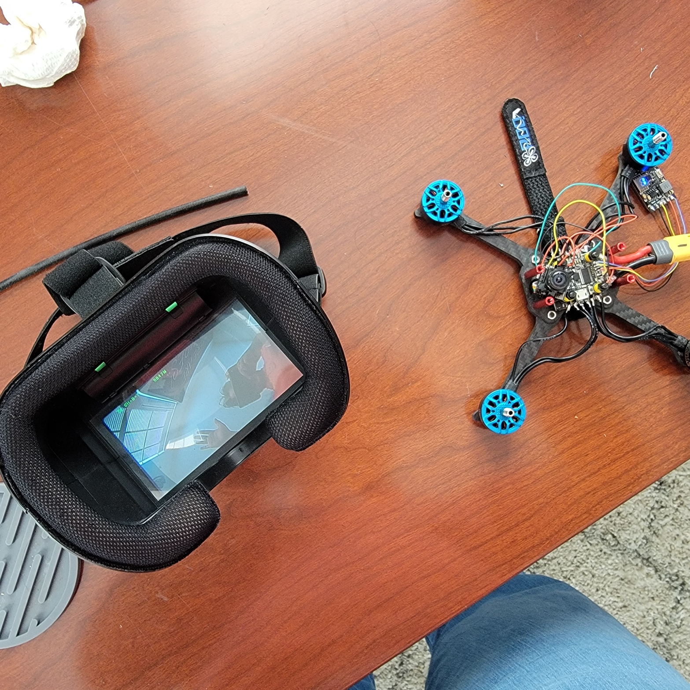
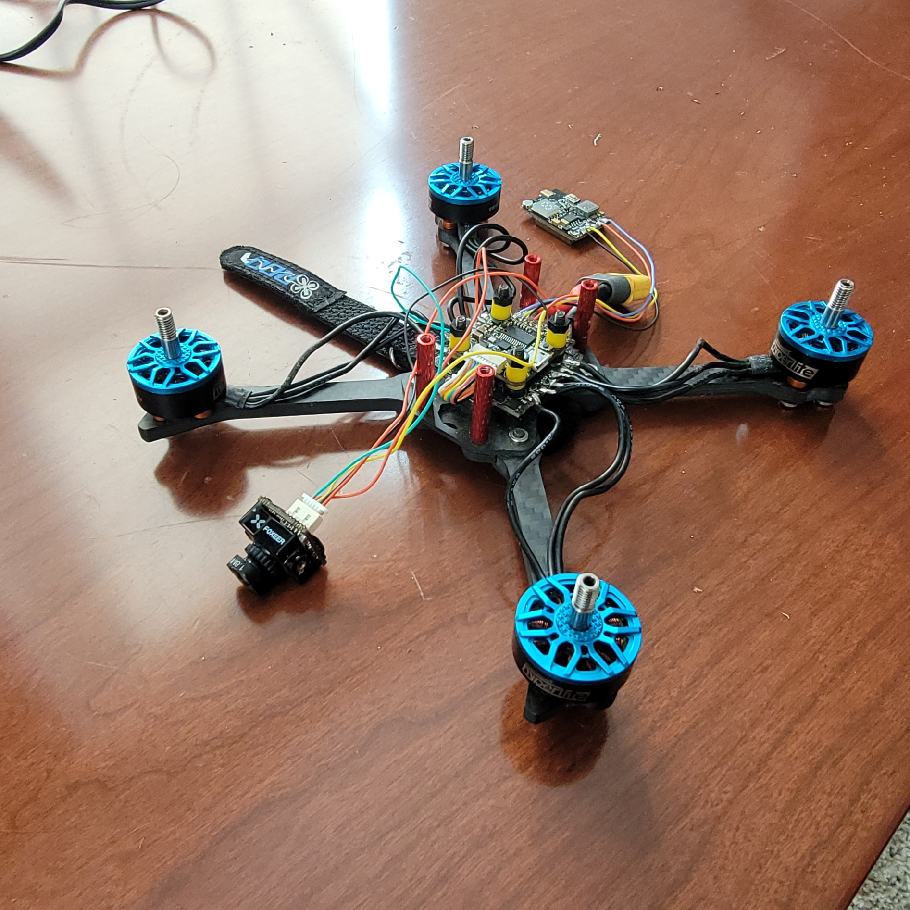
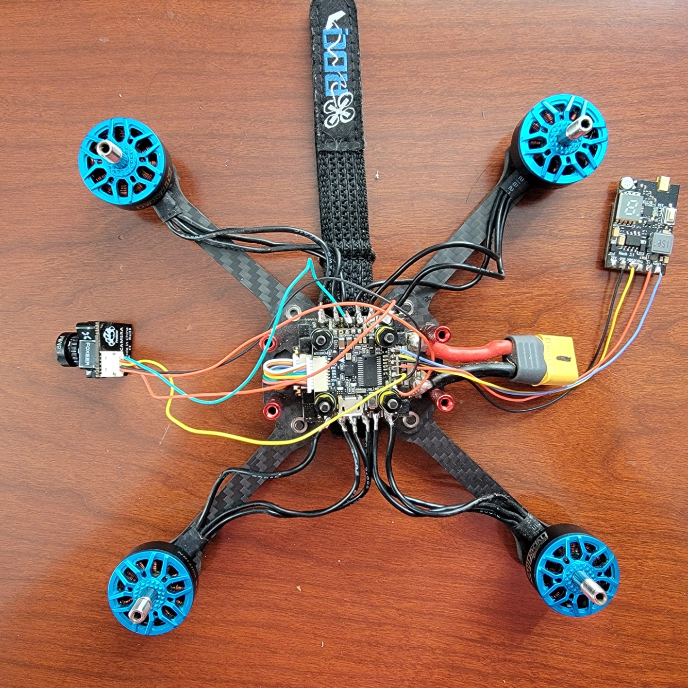

## Members
David Encarnacion, Electrical Engineering Student (2024)
daveencar03@vt.edu

## Mentor
MENTOR NAME HERE

## Current Status
IN PROGRESS

## Project Overview

Designing an FPV drone using parts given to me by a colleague who recently graduated

## Educational Value Added

Skills involved include wireless radio communications, soldering, and part analysis

## Tasks

- Connect ELRS Receiver
- Obtain an RC Controller compatible with my ELRS Transmitter Module
- Install propellers
- Verify functionality
- Organize wiring
- Fly!

## Design Decisions

Part selection is constrained by what I have available. I would rather search for parts compatible with what I have now as opposed to purchasing brand-new parts and starting from scratch

## Design Misc

<!-- Your Text Here. You may work with your mentor on this later when they are assigned -->

## Steps for Documenting Your Design Process

- Establish an engineering journal
- Document parts purchased/ obtained
- Record resources used to help guide me (This is my first time after all)
- Document construction process and general notes/ tips

## BOM + Component Cost

<!-- Your Text Here. You may work with your mentor on this later when they are assigned -->

## Timeline

Fly by the end of Fall 2024 or the beginning of Spring 2025

## Useful Links

##Images

#Above depicts the drone on and in its current state of operations, showing myself waving through the FPV headset (11/11)

#Above depicts an isometric view of the current state of the drone (11/11)

#Above depicts a top-down view of the current state of the drone (11/11)

## Log

(11/11) Project Approved!
